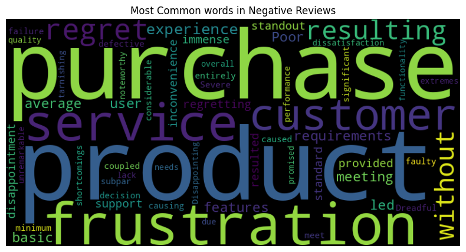

# 📊 Sentiment Analysis & Word Cloud Project


A sentiment analysis pipeline that classifies customer reviews as **Positive**, **Negative**, or **Neutral** using **TextBlob**, then visualizes the results with a sentiment distribution chart and a word cloud of the most common terms in negative reviews — surfacing what actually drives customer dissatisfaction.

---

## 📌 Table of Contents
- [Overview](#overview)
- [Tech Stack](#tech-stack)
- [Dataset](#dataset)
- [Workflow](#workflow)
- [Results](#results)
- [Sample Output](#sample-output)
- [How to Run](#how-to-run)
- [Project Structure](#project-structure)
- [Key Insights](#key-insights)
- [Future Improvements](#future-improvements)
- [Author](#author)

---

## Overview
Customer feedback is one of the richest sources of insight a business has — but reading through hundreds of reviews manually doesn't scale. This project automates that process end-to-end: it takes raw review text, scores each sentence's sentiment polarity, classifies it, and visualizes the results so patterns in customer satisfaction (and dissatisfaction) become immediately visible.

The goal is to answer two questions at a glance:
1. **How do customers feel overall** about the product/service?
2. **What specifically** are unhappy customers complaining about?

## Tech Stack
| Category | Tools |
|---|---|
| Language | Python |
| Data Handling | pandas, numpy |
| Sentiment Analysis | TextBlob |
| Visualization | matplotlib, seaborn |
| Text Visualization | wordcloud |
| Environment | Google Colab / Jupyter Notebook |

## Dataset
A collection of customer review sentences covering product quality and service experience, stored in `Sentiment_Analysis.csv`. Each row contains a single review sentence to be classified.

## Workflow
1. **Load data** — import review sentences from CSV into a pandas DataFrame
2. **Score sentiment** — apply TextBlob polarity scoring to each sentence
3. **Classify** — label each review as:
   - `Positive` if polarity > 0
   - `Negative` if polarity < 0
   - `Neutral` if polarity = 0
4. **Export** — save labeled results to `Sentiment_Labeled.xlsx` for further use
5. **Visualize distribution** — plot a pie chart of overall sentiment breakdown
6. **Isolate negative feedback** — filter out only the negative reviews
7. **Generate word cloud** — combine negative review text and visualize the most frequent terms

## Results

| Sentiment | Count | Percentage |
|---|---|---|
| Positive | 12 | 54.55% |
| Negative | 9 | 40.91% |
| Neutral | 1 | 4.55% |

**Total reviews analyzed:** 22

## Sample Output

**Sentiment Distribution**


**Word Cloud — Negative Reviews**


## How to Run

```bash
# 1. Clone the repository
git clone https://github.com/LAXMI15PRIYA/sentiment-analysis-wordcloud.git
cd sentiment-analysis-wordcloud

# 2. Install dependencies
pip install pandas numpy matplotlib seaborn textblob wordcloud

# 3. Download TextBlob corpora (first-time setup only)
python -m textblob.download_corpora

# 4. Launch the notebook
jupyter notebook Sentiment_Analysis_&_Word_Cloud_Project.ipynb
```

Alternatively, click **"Open in Colab"** at the top of the notebook file on GitHub to run it instantly in your browser — no local setup required.

## Project Structure

## Key Insights
- The majority of feedback (**54.55%**) is positive, indicating overall satisfaction with product/service quality.
- Negative feedback (**40.91%**) clusters heavily around **customer support** and **product defects** — the word cloud surfaces recurring terms like *purchase*, *service*, *product*, *regret*, *disappointment*, and *shortcomings*.
- Only **4.55%** of reviews were neutral, suggesting customers tend to have strong, decisive opinions rather than lukewarm ones.
- These patterns point to support responsiveness and product quality control as the top priority areas for improvement.

## Future Improvements
- Use a more robust sentiment model (e.g., VADER, or a fine-tuned transformer like BERT) for higher accuracy on nuanced or sarcastic text
- Add topic modeling (e.g., LDA) to automatically categorize *why* reviews are negative — shipping, pricing, defects, support, etc.
- Expand the dataset for more statistically reliable sentiment percentages
- Build an interactive dashboard (Streamlit or Power BI) so stakeholders can explore sentiment trends without opening the notebook
- Add a positive-review word cloud for a fuller comparison of what customers praise vs. criticize

## Author
**Lakshmi**
M.Tech AI & Data Science | Aspiring Data Analyst / AI Engineer
🔗 [GitHub](https://github.com/LAXMI15PRIYA)

---
⭐ If you found this project useful, consider giving it a star!
